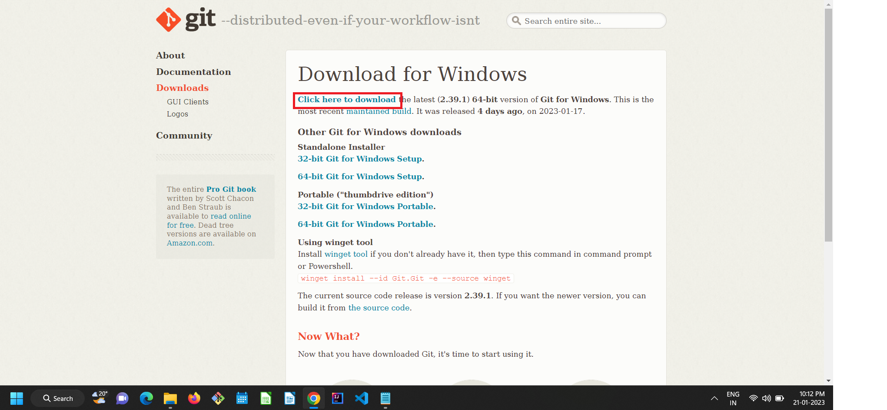
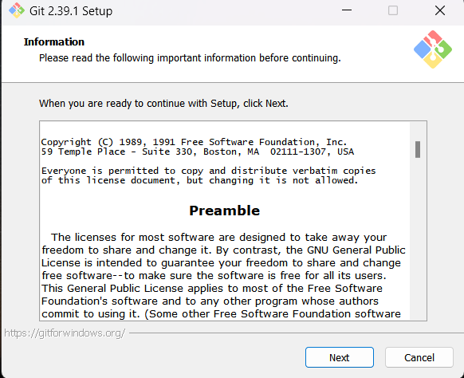
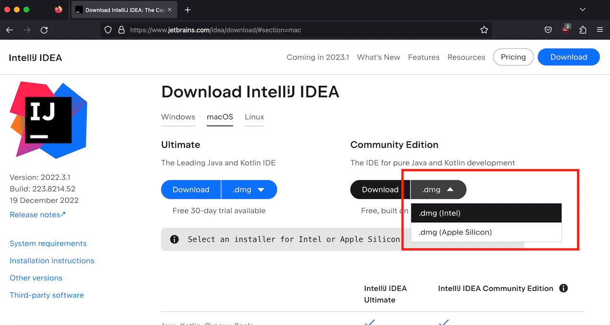
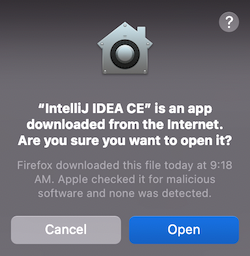

# The goal
TODO
Overview of what we'll be learning but from the perspective of the final objective. 
What do you want to be able to do after the bootcamp ends?
Mainly placeholder at this point. It makes sense to visit this and add specifics after the curriculum is finalized

# Understanding a web application

A web application is a program that runs on a web server and is accessed over the internet through a web browser. When a user navigates to the URL of a web application in their web browser, the browser sends a request to the web server where the application is hosted. 

The web server then processes the request, which can include querying a database, performing calculations, or executing other logic. The server generates a response, which is typically in the form of an HTML document, and sends it back to the user's browser. 

The browser then renders the HTML and displays the web page to the user. The user can interact with the web page by clicking buttons, filling out forms, and so on. These actions trigger additional requests to the server, which then sends back additional responses, allowing the user to interact with the web application in real time.

## Application architecture

The three-tier architecture is a software design pattern commonly used in the development of web applications. It is comprised of three distinct layers: the presentation layer, the application logic layer, and the data layer.

The presentation layer is the user interface, which is the part of the application that the user interacts with. This layer is responsible for the look and feel of the application, and is typically implemented using HTML, CSS, and JavaScript. It communicates with the application logic layer to receive data and present it to the user.

The application logic layer contains the business logic of the application. This is where the bulk of the application's functionality is implemented. It communicates with both the presentation layer to receive user input and provide data for rendering, and the data layer to retrieve and store data.

The data layer is responsible for providing an interface to the data stored in a database. It abstracts the underlying database technology, making it easy to switch to a different database system without changing the application logic. This layer communicates with the application logic layer to retrieve and store data, which is in turn called by the presentation layer.

The separation of the application into these distinct layers allows for greater flexibility and maintainability, as each layer can be developed and modified independently of the others.

Note: 
This architecture is a common starting point for web applications and is surely the simplest. There are several other advanced architecture styles - like distributed microservices. For most of this bootcamp, keep this three tier architecture in mind. Once you are comfortable with this model, we will be switching to the distributed model and looking at more advanced architectures.

## Frontend vs Backend
The front end and back end of a web application refer to the different components that make up the overall system.

The front end, also known as the client-side, is the portion of the application that is responsible for the user interface and the way the user interacts with the application. It is what the user sees and interacts with when they visit a website. The front end is typically implemented using technologies such as HTML, CSS, and JavaScript. It communicates with the back end to retrieve data and display it to the user, as well as to send user input to the back end for processing.

The back end, also known as the server-side, is responsible for the behind-the-scenes functionality of the application. It handles tasks such as processing user input, querying databases, performing calculations, and generating responses. The back end is typically implemented using languages such as Python, Ruby, or Java, and it may use technologies such as web frameworks, databases, and APIs.

In summary, the front end is responsible for the user interface, and how user interacts with the application, while the back end handles the application logic, calculations, database and server-side tasks.

The front end and back end communicate with each other using a variety of techniques, such as HTTP requests and responses. When a user interacts with a front-end feature of the website, such as a form submission, it sends an HTTP request to the server, the back-end, which then processes the data, interacts with the database if needed, and sends a response back to the front-end to be displayed to the user.

## How a web request works

When a JavaScript client application makes an HTTP request to a Java back-end service, the following steps occur:

- The JavaScript client application creates _request_ object. This object contains information such as the method (e.g. GET, POST, PUT), the URL, and any data that needs to be sent with the request.
- The JavaScript client sends the request to the server using the XMLHttpRequest or Fetch API. This is an asynchronous operation, which means the JavaScript code will continue to execute while the request is being processed.
- The request is received by the back-end service, which is typically implemented using a Java web framework such as Spring. The framework extracts the information from the request, such as the method and the URL, and routes it to the appropriate code in the back-end service.
- The back-end service processes the request, which can include querying a database, performing calculations, or executing other logic. 
- The back-end service generates a response, which is typically in the form of an HTTP response object. The response contains information such as the status code (e.g. 200 OK, 404 Not Found) and any data that needs to be sent back to the client.
- The response is sent back to the JavaScript client application. The JavaScript client receives the response and can process the data or update the user interface accordingly.

It's important to note that the request and response are sent over the HTTP or HTTPS protocol, which provides a standardized way for web clients and servers to communicate. And also to note that the above is a common pattern, with many variations and alternatives using different technologies and protocols such as WebSockets, gRPC and so on.

In this bootcamp, we will focus on the most popular protocol used for this today - using HTTP and HTTPS.


# What we'll be building
TODO
Placeholder explaining the final projects

# Where we'll be building
TODO
Explain dev workflow
- Setup Java locally
- Setup database locally
- Execute and verify locally
- Deploy to cloud (TBD)

# Setting up Java
TODO
Steps to get Java installed 
    - OpenJDK option
    - Docker option
Possibly prerecorded videos. Need offline support

# Setting up a relational DB (PostgresDB)
TODO
Steps to get PostgresDB installed locally
    - Offline installer (https://www.postgresql.org/download/)
    - Docker option
Possibly prerecorded videos. Need offline support

# Git and GitHub
### On windows
## On Windows
1. Go to download page using the following link

   [https://git-scm.com/downloads](https://git-scm.com/downloads)

2. Click on Windows to download for windows
   
3. Upon on clicking on it, you will be navigated to the following page, click 'Click here to download' and Git bash will be downloaded.
   
4. Now, double-click on downloaded exe file. You will be prompted to select Yes or No, select Yes.
5. Installation window will open, click on Next and you will be asked to choose installation directory, choose it and click on next.
   
   
6. For the next upcoming screens just choose the default options and click next and wait for the installation to complete.
7. After the installation is finished, click on Finish.
8. To verify if git was properly installed, open terminal/command prompt/git bash and type

   ```git --version```
9. You should see something like this.
   
    ### Post Install
10. Now that git is successfully installed, there are a couple of things that needs to be done.
    1. First, configure your username and email since every git commit uses this information, type the following commands in terminal

                git config --global user.name "Vijaysai"
                git config --gloabl user.email "vijaysai@example.com"
    2. To verify if your username and email were properly set use the following command
    
        ```git config user.name``` 
    
        ```git config user.email``` 
       
       You should see the email and name that you have set earlier, if not run the commands in step 10.1 again.
    4. Now clone the repository using the following command 
       
       ```git clone https://github.com/koushikkothagal/java-backend-bootcamp.git```
    

# Setting up IntelliJ
## On MacOS
1. Go the download page by clicking the link.

   [https://www.jetbrains.com/idea/download/?ij80pr#section=mac](https://www.jetbrains.com/idea/download/?ij80pr#section=mac)

2. Click on .dmg underneath Community Edition and select option appropriate for your processor.


3. After the download has finished, click on the completed download.


4. Click and drag the IntelliJ IDEA CE icon over to the Applications folder.


5. When you click on the IntelliJ IDEA CE icon, you may be prompted with a query asking if you want to open it. Click on Open to open IntelliJ IDEA. 



6. Click on New Project.


7. Click on JDK and select your newly downloaded Java 17 from the previous section.


8. When you open your project for the first time, IntelliJ will be indexing the JDK. You will be able to use the IDE after indexing is complete!


 ### Post Install
 ## Git
9. Click on VCS (Version Control System) and click on "Enable Version Control Integration" on your project. 


10. You will be prompted with choices for "Version Control Integration". Select Git and then OK. 


# Demo of an individual Git + GitHub workflow
TODO

Process of setting up a new GitHub repo, cloning, making changes, commit and push
Cloning a repo, submitting a pull request

# Homework
[Instructions](homework.md)
